 # Ops Care Dashboard

 A web-based healthcare operations management dashboard for optimizing resource allocation, improving patient flow, and enabling data‑driven decision making across hospitals and clinics.

 ## 1. Problem Statement

 ### 1.1 Background

 Healthcare operations management faces significant challenges in optimizing resource allocation, patient flow, and overall operational efficiency. Hospitals and clinics often struggle with:

 - Inefficient patient scheduling and resource allocation  
 - Lack of real-time visibility into operational metrics  
 - Manual processes leading to delays and errors  
 - Difficulty in predicting and managing bed occupancy  
 - Poor coordination between clinical and operational staff  

 ### 1.2 Problem Definition

 The Ops Care Dashboard addresses the critical need for a comprehensive healthcare operations management system that provides:

 - Simulation-based optimization for resource allocation (beds, ORs, clinics)  
 - Real-time monitoring of hospital operations and performance metrics  
 - Role-based access control for different healthcare stakeholders  
 - Automated reporting and audit trails for compliance  
 - Integration capabilities with existing hospital systems  

 ### 1.3 Objectives

 The main objectives of the Ops Care Dashboard are to:

 - Reduce patient wait times through optimized scheduling  
 - Improve resource utilization across hospital departments  
 - Provide data-driven insights for operational decision-making  
 - Ensure compliance through comprehensive audit logging  
 - Enable predictive analytics for capacity planning  

 ## 2. User Stories

 ### 2.1 Admin Users

 - As an admin, I want to manage user accounts and roles so that I can control system access and permissions.  
 - As an admin, I want to view comprehensive audit logs so that I can monitor system usage and ensure compliance.  
 - As an admin, I want to generate reports on system usage and performance so that I can make informed decisions.  

 ### 2.2 Clinical Users

 - As a clinical user, I want to submit simulation requests for patient scenarios so that I can optimize treatment planning.  
 - As a clinical user, I want to view feedback on submitted requests so that I can improve future submissions.  
 - As a clinical user, I want to access patient management tools so that I can efficiently manage patient care.  

 ### 2.3 Operator Users

 - As an operator, I want to manage pharmacy requests so that I can ensure timely medication delivery.  
 - As an operator, I want to view simulation results so that I can implement operational improvements.  
 - As an operator, I want to monitor real-time system status so that I can respond to issues promptly.  

 ### 2.4 Pharmacist Users

 - As a pharmacist, I want to manage medicine inventory so that I can maintain adequate stock levels.  
 - As a pharmacist, I want to process medication requests so that patients receive timely care.  
 - As a pharmacist, I want to track medication usage patterns so that I can optimize inventory management.  

## 3. System Architecture and Design

### 3.1 System Architecture Overview

The Ops Care Dashboard follows a modern web application architecture comprising:

- **Frontend**: React-based single-page application (SPA) built with Vite and TypeScript  
- **Backend**: RESTful API server with a microservices architecture  
- **Database**: NoSQL database for flexible and scalable data storage (AWS DynamoDB)  
- **Authentication**: Cloud-based identity management via AWS Cognito  
- **Simulation Engines**: Python-based discrete event simulation (DES) services  

## 4. Technology Used

- **TypeScript**: Strongly typed language for the React frontend, improving reliability and maintainability.  
- **Python (DES)**: Python-based discrete event simulation engines used to model and optimize patient flow and resource utilization.  
- **AWS Cognito**: Manages user authentication, tokens, and secure access control.  
- **AWS DynamoDB**: NoSQL database used for audit logs, simulation requests/results, pharmacy stock, and other operational data.  

## 5. Getting Started

 ### 4.1 Prerequisites

 - Node.js (LTS) and npm or a compatible package manager  
 - Git (to clone the repository)  

 ### 4.2 Installation

 ```bash
 # Clone the repository
 git clone <your-repo-url>
 cd ops-care-dash-main

 # Install dependencies
 npm install
 ```

 ### 4.3 Running the App

 ```bash
 # Start the development server
 npm run dev
 ```

 The app should now be available at the URL shown in your terminal (typically `http://localhost:5173` for Vite).

## 6. Screenshots and Outputs

 Below are sample screenshots and outputs from the Ops Care Dashboard:

    ## 6.1. Login Page (same for all roles trying to access their respective pages, uses AWS Cognito for authentication)
 - 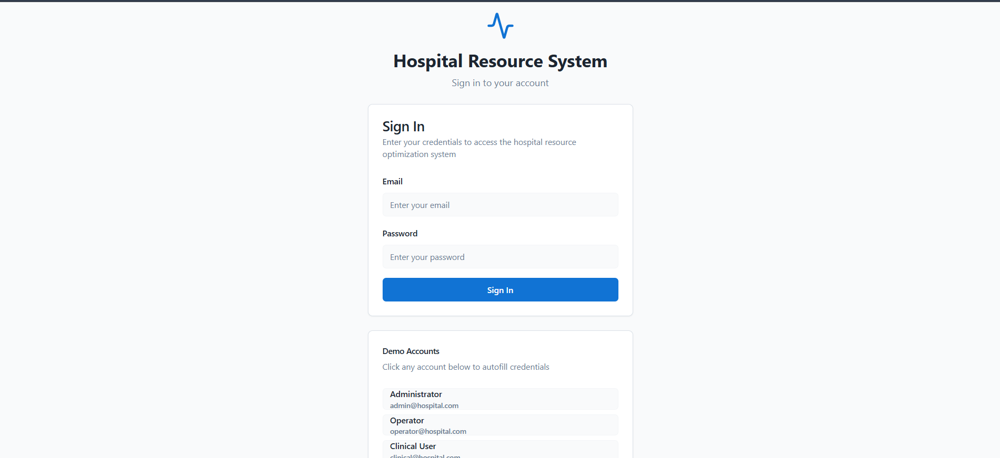
    
    ## 6.2. Adding User feature in Admin home page (adds users to the AWS Cognito user pool)
 - 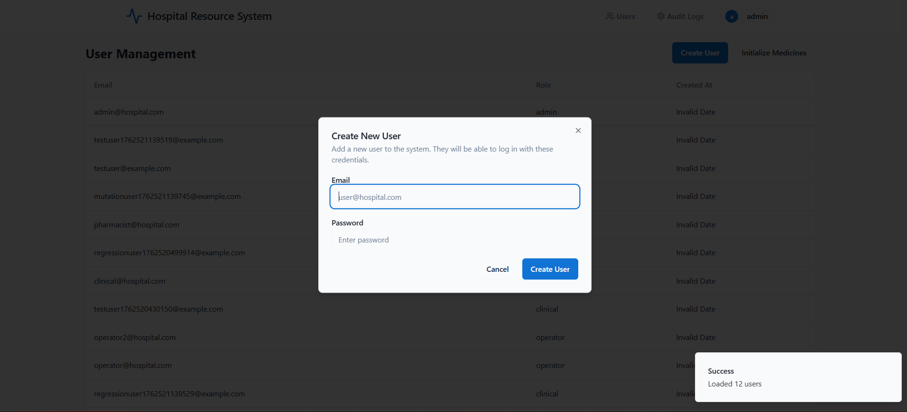
    
    ## 6.3. Audit Logs which can be viewed only by Admin (logs are stored in AWS DynamoDB, can be downloaded as a CSV file via frontend)
 - 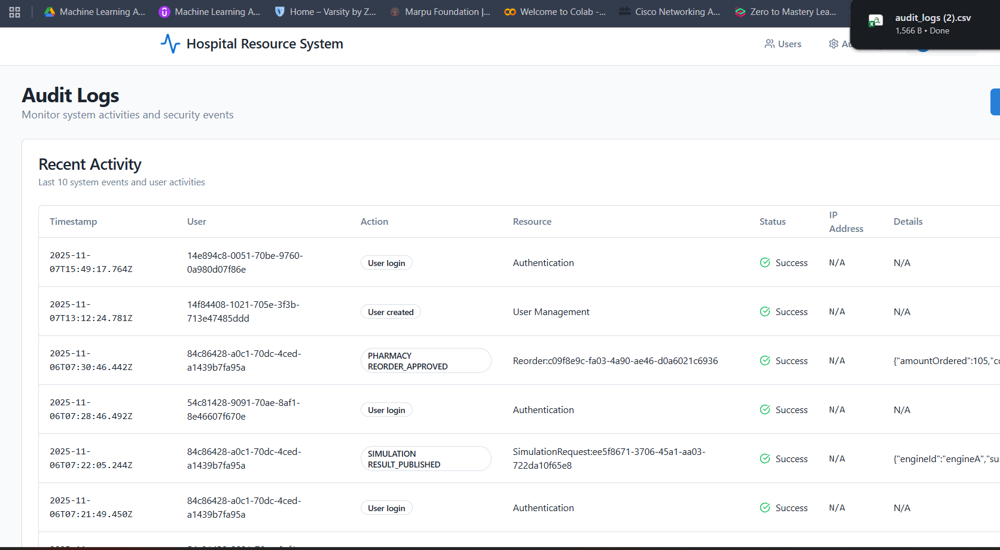

    ## 6.4. Clinical User sending Simulation request to Operator 
 - 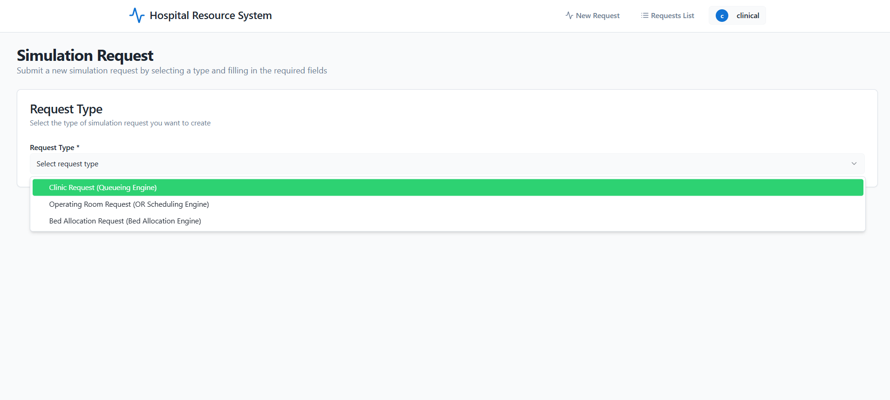

    ## 6.5. Clinical User entering request details of their particular request (request details stored in DynamoDB) 
 - 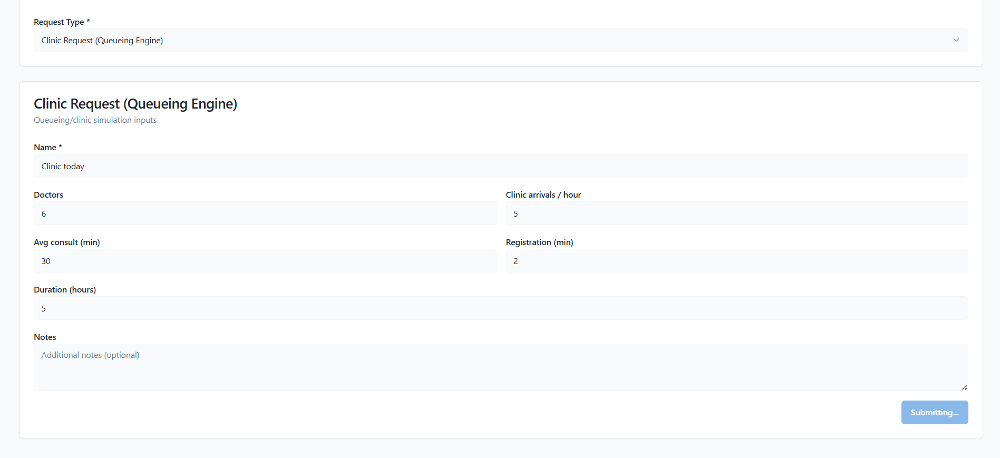

    ## 6.6. Results page where Clinical User can view the results and details of completed simulation request
 - 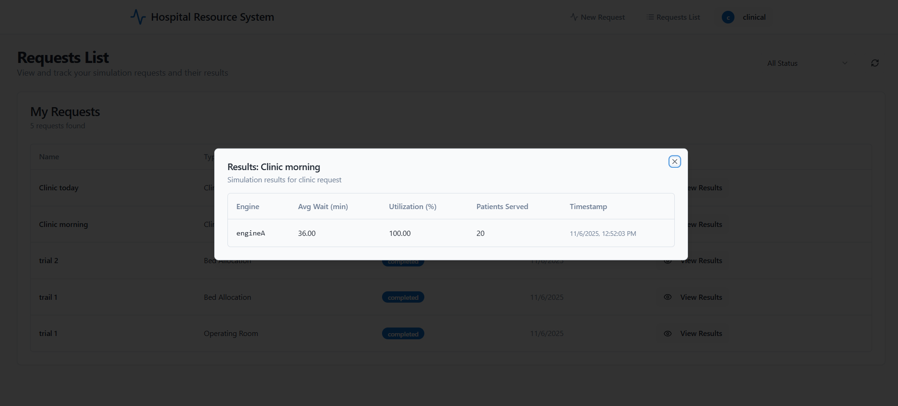

    ## 6.7. Operator home page where the simulation requests can be viewed , verified and run (fetched from DynamoDB)
 - 

    ## 6.8. Operator viewing the results of concluded simulation request
 - 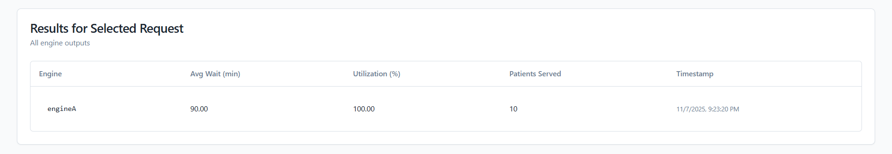

    ## 6.9. Operator viewing Pharmacy requests for replenishing medicine stock
 - 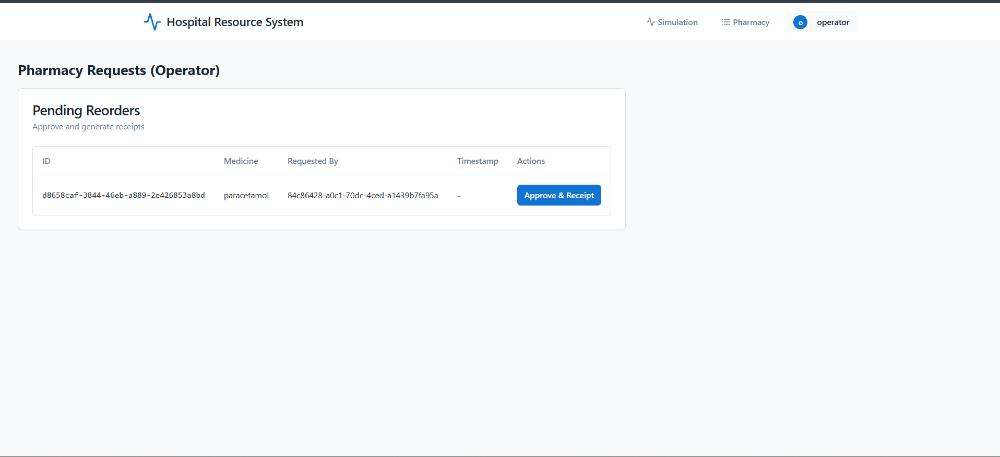

    ## 6.10. Operator approving the Pharmacy requests
 - 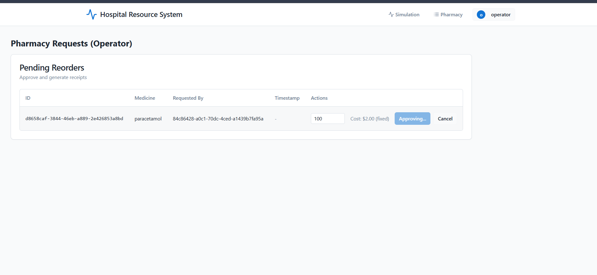

    ## 6.11. Receipt generation , viewed by operator , after request goes through
 - 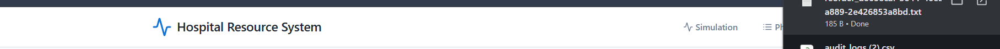

    ## 6.12. Pharmacist home page where request to replenish stocks can be given
 - 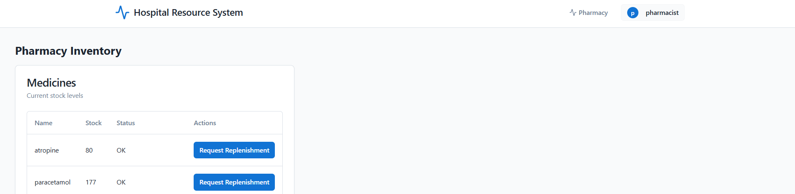

