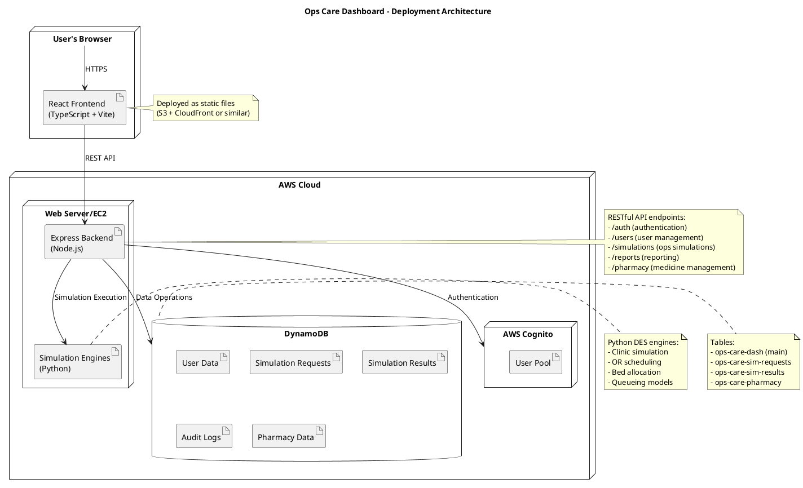

# Ops Care Dashboard - Deployment Architecture

## Architecture Overview

This deployment diagram shows the Ops Care Dashboard architecture with the following components:

- **Frontend**: React application built with TypeScript and Vite, deployed as static files
- **Backend**: Node.js Express server handling API requests
- **Authentication**: AWS Cognito User Pool for user management and authentication
- **Database**: DynamoDB with multiple tables for different data types
- **Simulation Engines**: Python-based discrete event simulation engines for healthcare operations modeling

## Key Features

- Role-based access control (Admin, Operator, Pharmacist, Clinical)
- Real-time simulation of healthcare operations
- Audit logging for compliance
- Pharmacy inventory management
- RESTful API architecture
